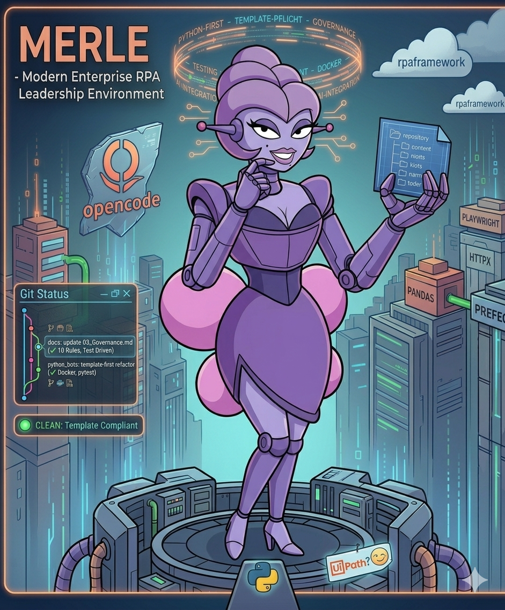
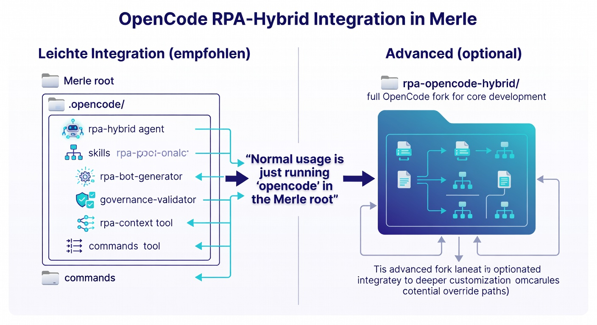

# Merle

[](./LICENSE)
[](https://github.com/maatini/merle)
[](https://python.org)
[](https://docs.astral.sh/uv/)
[](./docs/concepts/strategie.md)
[](https://github.com/maatini/merle)
[](docs/ROADMAP.md)

> **📖 Source Available — Proprietary License**  
> Dieses Repository ist öffentlich einsehbar (seit 2026-05, siehe [ADR-0009](./docs/decisions/0009-repository-public-source-available.md)).  
> Der gesamte Code bleibt **urheberrechtlich geschütztes Eigentum von Martin Richardt**.  
> Eine produktive Nutzung, Modifikation oder Weitergabe ist nur mit expliziter Lizenz / gültigem NDA gestattet.  
> Siehe [LICENSE](./LICENSE) und [ADR-0009](./docs/decisions/0009-repository-public-source-available.md). Unautorisierte kommerzielle Nutzung wird rechtlich verfolgt.

<p align="center">
  
</p>

**Modular Enterprise RPA Lifecycle Engine**  
_Python-first hybrid RPA framework for maintainable, testable, and cost-efficient automation._

**80–90 % Python (Playwright mit Chromium/Lightpanda, pandas, Prefect, loguru, tenacity, NATS) — UiPath only when it delivers a proven architectural advantage.**  
**Vision: Granular, NATS-based orchestration with intelligent executors (Python / KI / UiPath) and BPMN-grade transparency.**

> **Current Status (v0.4 – Professional Foundation):**  
> Production-ready `merle-core`, official Copier template, `merle` CLI, strong CI + pre-commit, `.opencode/` RPA agent, and full governance. Ready for internal enterprise use and scaling.

**Zukünftig (Roadmap):** Granulare NATS-Orchestrierung, KI-Executor, Prefect 3 Patterns, Self-Healing auf Task-Ebene.

---

## Schnellstart (uv + just)

```bash
# 1. Repository klonen & Entwicklungsumgebung (einmalig)
git clone <repo>
cd merle
just setup          # uv sync --all-packages + pre-commit + merle CLI

# 2. Neuen Python-Bot mit einem Befehl erzeugen (empfohlen)
just new-bot invoice_processor --playwright --pandas
# oder direkt: uv run merle new-bot invoice_processor --playwright --pandas

cd python_bots/invoice_processor
uv run python main.py

# 3. Qualität & Tests
just lint
just mypy
just test

# Docker (für einen generierten Bot)
docker build -t invoice-processor python_bots/invoice_processor
```

> **Hinweis**: Der `merle` CLI (via `tools/merle/`) und `just new-bot` / `merle new-bot` sind der **offizielle** One-Command-Flow (Template-First).  
> `merle-core` (SSOT in `packages/merle-core/`) wird **nur** als Dependency referenziert — keine Code-Duplikation in generierten Bots.

**Alternative ohne just:**

```bash
uv sync --group dev --all-packages
uv run merle new-bot my_bot --playwright
copier copy templates/bot python_bots/my_bot   # direkter Copier-Aufruf
```

---

## Philosophie

| Prinzip                  | Beschreibung                                            |
| ------------------------ | ------------------------------------------------------- |
| **Python-First**         | Python ist der Default für alle Automatisierungen       |
| **UiPath nur begründet** | UiPath kommt nur bei nachgewiesenem Vorteil zum Einsatz |
| **Template-First**       | Alle Bots entstehen aus dem professionellen Template    |
| **Container-Fähig**      | Jeder Bot läuft im Linux-Container                      |
| **Testgetrieben**        | Unit-Tests, Integration-Tests, CI/CD                    |
| **Governance**           | Klare Regeln, Entscheidungsmatrix, ADRs                 |

---

## Vision & Zukünftige Erweiterungen

Merle entwickelt sich schrittweise zu einer hochskalierbaren, intelligenten und kosteneffizienten Enterprise-RPA-Orchestrierungsplattform. Die folgenden Erweiterungen sind als zentrale Roadmap-Bausteine geplant:

- **Aufteilung von RPA-Tasks in kleinere abgeschlossene Teil-Tasks**  
  Komplexe RPA-Prozesse werden in feingranulare, eigenständig ausführbare und versionierbare Teil-Tasks zerlegt. Dies ermöglicht bessere Parallelisierung, isolierte Fehlerbehandlung, einfacheres Testing, Wiederverwendbarkeit und eine höhere Gesamt-Resilienz des Systems.

- **Speicherung der Teil-Tasks in NATS (Message Broker)**  
  Alle Teil-Tasks, deren Status und Metadaten werden über den hochperformanten, cloud-nativen Message Broker **NATS** verwaltet. NATS bietet persistente Queues, JetStream, Pub/Sub, Request-Reply und exzellente Skalierbarkeit – die ideale Grundlage für eine lose gekoppelte, event-getriebene Architektur. Zur Einsicht und Verwaltung der Streams und Nachrichten nutzen wir die UI **[Cobra-NATS](https://github.com/maatini/cobra-nats)**.

- **Intelligenter Orchestrator verteilt Teil-Tasks auf Rechen-Ressourcen**  
  Ein zentraler, hochverfügbarer Orchestrator übernimmt das Scheduling und Routing der Teil-Tasks auf die verfügbaren Worker-Ressourcen (Docker-Container, Kubernetes-Pods, On-Prem-Server, Cloud-Instanzen). Die Verteilung erfolgt dynamisch und unter Berücksichtigung von Echtzeit-Metriken.

- **Anforderungsprofile für Tasks (UiPath, Python, GPU, RAM+HDD etc.)**  
  Jeder Task und Teil-Task kann ein detailliertes Anforderungsprofil deklarieren:

  - Technologie-Stack: `UiPath`, `Python`, `Path` (andere RPA-Tools)
  - Hardware-Ressourcen: GPU (für ML/CV), CPU-Kerne, RAM, HDD/SSD-Kapazität, Netzwerk-Bandbreite
    Der Orchestrator matched diese Anforderungen automatisch an passende Worker-Nodes (z. B. dedizierte UiPath-Lizenz-Worker oder GPU-beschleunigte Nodes).

- **Prioritäten für Tasks**  
  Tasks und Teil-Tasks erhalten Prioritäten (z. B. `critical`, `high`, `normal`, `low` oder numerisch). Der Orchestrator berücksichtigt diese Prioritäten bei der Scheduling-Entscheidung, um geschäftskritische Prozesse bevorzugt und termingerecht auszuführen (SLA-Support).

- **Ressourcen-Optimierung zur Kosten-Minimierung**  
  Durch intelligente Algorithmen (Predictive Scaling, Workload-Konsolidierung, bevorzugte Nutzung von Spot/Preemptible Instances, Auto-Hibernation nicht ausgelasteter Ressourcen) wird die Ressourcenauslastung optimiert. Ziel ist die nachhaltige Senkung der Betriebskosten bei gleichbleibender oder höherer Durchsatzleistung. Relevante KPIs: Cost-per-Execution, Resource Utilization, Idle-Time.

- **KI als möglicher Executor**  
  Zukünftig können KI-Komponenten (LLM-basierte Agenten, spezialisierte ML-Modelle, Vision-Modelle etc.) als vollwertige Executor für geeignete Teil-Tasks eingesetzt werden. Anwendungsfälle: intelligente Dokumentenklassifikation & -extraktion, kontextbezogene Entscheidungsfindung, Self-Healing bei Fehlern, generative Erstellung von Teil-Logik oder sogar vollständige KI-gestützte Prozessautomatisierung.

- **Transparente Orchestrierung analog BPMN**  
  Die gesamte Task-Orchestrierung, Abhängigkeiten, Datenflüsse, Status-Übergänge und Ausführungshistorie sollen visuell transparent und nachvollziehbar dargestellt werden – angetrieben von der **[BPMNinja Engine](https://github.com/maatini/bpmninja)**. Dies ermöglicht:
  - Einfaches Auditing & Compliance
  - Prozessoptimierung durch Fachabteilungen
  - Bessere Zusammenarbeit zwischen Citizen Developers und RPA-Experten
  - Visuelle Dashboards und Drill-Down-Analysen

Diese Erweiterungen bauen auf dem bestehenden Python-First-Ansatz, Prefect 3.x, Docker und der bestehenden Governance auf. Sie führen Merle schrittweise in Richtung einer vollständig hybriden, KI-gestützten, kostenoptimierten und vollständig transparenten Enterprise-RPA-Plattform.

---

## OpenCode in Merle: RPA-Hybrid-Architekt

Merle bringt eine **projekt-lokale OpenCode-Konfiguration** mit (`/.opencode/`). Sobald du `opencode` im Root des Merle-Repositories startest, ist automatisch der **RPA-Hybrid-Architekt** als Primary Agent aktiv. Er kennt die Entscheidungsmatrix, alle Governance-Regeln, Templates und die Cloud-Native-Architektur im Detail.

### Einfache Nutzung

```bash
# Im Merle-Root
opencode
# → rpa-hybrid Agent ist sofort verfügbar
# → Skills: rpa-process-analyzer, rpa-bot-generator, governance-validator
# → Command: /rpa-new-bot, /rpa-validate
# → Tool: load_rpa_context (MCP)
```

### Cloud-Native RPA im Azure AKS

Da unsere Software-Roboter nicht lokal auf Desktops, sondern **zentral und hochskalierbar in der Cloud (z. B. Azure AKS Cluster)** ausgeführt werden, gelten besondere Anforderungen an den Code. Der RPA-Hybrid-Architekt unterstützt das Entwicklungsteam gezielt bei der Umsetzung dieser Cloud-Native-Paradigmen:

- **Container-Readiness:** Automatisierte Erstellung von Headless-fähigem Code (Playwright, Linux-kompatible Bibliotheken), der ohne Windows-Abhängigkeiten in Docker-Containern und Pods läuft.
- **Stateless & Robust:** Erzwingung von Retry-Mechanismen (Tenacity) und strukturiertem Logging (Loguru) für resiliente Bot-Ausführungen in flüchtigen Cloud-Umgebungen.
- **NATS & Orchestrierung:** Direkte Unterstützung bei der Anbindung an unseren NATS Message Broker für ereignisgesteuerte, verteilte Task-Bearbeitung.

### Integrierte Governance & Tools

Der Agent agiert als strikter Wächter der [Entscheidungsmatrix](docs/concepts/entscheidungsmatrix.md) und der Projekt-Governance. Dazu stehen folgende Erweiterungen im `.opencode/`-Verzeichnis zur Verfügung:

1. **`rpa-context` (MCP Tool):** Lädt Projekt-Dokumentationen dynamisch (`load_rpa_context strategy`, `dev-guide`, `governance` …).
2. **`rpa-bot-generator` (Skill):** Erzeugt neue Python-Bots **ausschließlich** auf Basis des verbindlichen Copier-Templates (`templates/bot/`) via `merle new-bot` oder Copier.
3. **`governance-validator` (Skill):** Prüft Code auf Einhaltung aller 11 Governance-Regeln (inkl. Rule 10: merle-core + BaseTask).
4. **Commands:** `/rpa-new-bot` und `/rpa-validate` für schnelle Workflows.

**Hinweis zur Fork-Version (Professional Foundation Decision):**  
Das Verzeichnis `rpa-opencode-hybrid/` enthält einen vollständigen OpenCode-Fork (~88 MB) und ist **ausschließlich** für die Entwicklung von OpenCode-Core-Patches und angepassten Desktop-Builds relevant.

**Für die tägliche RPA-Bot-Entwicklung genügt die schlanke `.opencode/`-Integration** im Repository-Root (Agent `rpa-hybrid`, Skills `governance-validator` + `rpa-bot-generator`, Commands `/rpa-new-bot`).

Wir haben bewusst **kein git submodule** für den Fork eingebunden (siehe Begründung in [AGENTS.md](AGENTS.md) und `.gitignore`). Dies hält `git clone` schnell und die Einstiegshürde niedrig. Bei Bedarf wird `maatini/merle-opencode-hybrid` als eigenständiges privates Repository geführt.

### Wie die RPA-Hybrid-Integration funktioniert



Durch diese tiefe Integration verringert OpenCode nicht nur die Entwicklungszeit, sondern garantiert vor allem die **architektonische Integrität** und **Betriebsstabilität** aller Bots in unserer Cloud-Umgebung.

---

## Repository-Struktur

```
.
├── docs/                     # Strategie, Governance, Leitfäden
│   ├── concepts/             # Kernkonzepte
│   │   ├── strategie.md      # Python-First Strategie
│   │   ├── entscheidungsmatrix.md  # Entscheidungsmatrix
│   │   ├── governance.md     # Governance-Regeln
│   │   ├── projektstruktur.md # Projektstruktur & Konventionen
│   │   ├── entwicklungsleitfaden.md  # Entwicklungsleitfaden
│   │   ├── architecture.md   # C4-Architektur + NATS-Vision
│   │   └── secrets-management.md  # Secrets Management
│   ├── decisions/            # ADR-Archiv (0001–0009)
│   ├── merle-core/           # merle-core Dokumentation
│   ├── development/          # Setup & Contributing
│   ├── getting-started/      # Quickstart & Junior-Guide
│   └── plans/                # Implementierungspläne
├── packages/
│   └── merle-core/           # ✨ Zentrales Core-Framework (SSOT)
│       ├── pyproject.toml
│       └── src/merle_core/   # BaseBot, BaseTask, Retry, Observability, Playwright (Chromium+Lightpanda), Secrets, NATS
├── templates/
│   └── bot/                  # ✨ Offizielles Copier-Template (merle new-bot)
│       ├── copier.yml
│       └── {{ bot_name }}/   # Jinja2-Templates + Hooks
├── examples/                 # Referenz-Bots (Invoice Processing, Web, Excel, NATS, UiPath Hybrid)
├── integration_examples/     # Python ↔ UiPath Muster
├── uipath_templates/         # UiPath-Templates (nur Ausnahmen)
├── tools/merle/              # merle CLI (merle new-bot)
├── agent/
│   └── CLAUDE.md             # Merle RPA-Hybrid-Architekt Persona
├── .opencode/                # OpenCode RPA-Erweiterungen (rpa-hybrid Agent, Skills, rpa-context Tool)
│   ├── agent/rpa-hybrid.md   # Primary Agent (automatisch aktiv bei `opencode`)
│   ├── skills/               # rpa-process-analyzer, rpa-bot-generator, governance-validator
│   ├── tool/rpa-context.ts   # MCP-Tool: load_rpa_context
│   └── command/              # /rpa-new-bot, /rpa-validate
├── AGENTS.md                 # AI-Agenten Kontext (DeepSeek-TUI etc.)
└── README.md                 # Diese Datei
```

> **Hinweis**: Das alte `python_bots/template/` wurde mit PR 1 (2026-05) entfernt. Neue Bots ausschließlich via `merle new-bot` oder `copier copy templates/bot`.  
> Zukünftige Verzeichnisse wie `orchestrator/`, `workers/`, `nats/`, `scheduler/` und `dashboards/` werden bei der Umsetzung der NATS-Vision (Phase 4) ergänzt.

---

## Dokumentation

Die vollständige Dokumentation findest du unter:

- **MkDocs Material** (empfohlen): `uv run mkdocs serve`
- Online (geplant): docs.merle.example.com

Wichtige Dokumente:

- [Architektur](docs/concepts/architecture.md) (inkl. C4-Diagramme)
- [Governance](docs/concepts/governance.md)
- [merle-core](docs/merle-core/index.md) (ab v0.2)
- [Beispiele](examples/README.md) (Web, Excel, UiPath-Hybrid)

---

## Technologie-Stack

### Python (Default)

- **RPA**: rpaframework ≥ 28.0
- **Web**: Playwright (Chromium + Lightpanda via CDP)
- **Daten**: pandas, openpyxl, pdfplumber
- **HTTP**: httpx (async)
- **Config**: pydantic-settings
- **Logging**: loguru
- **Retry**: tenacity
- **Orchestrierung**: Prefect 3.x (aktuell) → zukünftig NATS + eigener Orchestrator
- **Testing**: pytest
- **Container**: Docker

### UiPath (Ausnahme)

- Integration über Orchestrator REST API
- Lose Kopplung (APIs, Queues, Dateien)

---

## Governance

**11 Regeln für jeden Bot:**

1. Python-First (Default)
2. Template verwenden
3. Keine hartcodierten Werte
4. Strukturiertes Logging
5. Retry-Mechanismen
6. Tests schreiben
7. Linux-Container-fähig
8. Dokumentation
9. Code-Review
10. merle-core nutzen (BaseBot/BaseTask)
11. Entscheidungen dokumentieren

Details: [Governance-Regeln](docs/concepts/governance.md)

---

## Für AI-Agenten

Wenn du als AI-Agent (Claude, DeepSeek, etc.) in diesem Repository arbeitest:

- Lies `AGENTS.md` für deinen System-Kontext
- Lies `agent/CLAUDE.md` für deine Persona als Merle RPA-Hybrid-Architekt
- Befolge die Governance-Regeln strikt
- Denke Python-first
- Berücksichtige bei zukünftigen Erweiterungen die Vision der granularen, NATS-basierten und KI-gestützten Orchestrierung

---

## Contributing

Beiträge zum Merle-Framework erfolgen ausschließlich durch autorisierte Mitarbeiter und Partner.

### Workflow für interne Entwickler

1. **Branch erstellen**: `feature/<kurzbeschreibung>` oder `fix/<issue>`
2. **Code-Qualität**:
   - `uv run ruff check --fix . && uv run ruff format .`
   - `uv run mypy packages/merle-core/src/merle_core`
   - `uv run pytest python_bots -v`
3. **pre-commit Hooks** (empfohlen):
   ```bash
   uv run pre-commit install
   ```
4. **PR erstellen** gegen `develop` (oder `main` für Hotfixes)
5. **Review**: Mindestens ein Senior RPA-Architekt + automatisierte CI (Ruff, Mypy, Tests, Trivy)

### Wichtige Regeln

- **Kein Code ohne Template**: Jeder neue Bot startet **ausschließlich** via `just new-bot` / `merle new-bot` (Copier-Template in `templates/bot/`).
- **merle-core** (`packages/merle-core/`) nur bei echter Wiederverwendbarkeit erweitern
- **Keine hartcodierten Secrets/Pfade**
- **Linux-Container-Kompatibilität** ist Pflicht
- Änderungen an der Architektur oder Governance → ADR in `docs/decisions/`

### Fragen?

- Technische Fragen → `#rpa-engineering` (Slack/Teams)
- Architektur-Entscheidungen → `docs/concepts/governance.md` + `agent/CLAUDE.md`

## Lizenz

**PROPRIETARY — INTERNAL USE ONLY**

Dieses Repository und alle darin enthaltenen Artefakte sind proprietär. Nutzung nur mit ausdrücklicher Genehmigung des Urhebers (Martin Richardt). Siehe [LICENSE](./LICENSE) für die vollständige Lizenz.

## Version

**0.4.0** — Phase 1 CLI Restructuring & Agent Command Integration — Mai 2026

Frühere Versionen:

- 0.3.0 — Mai 2026 (NATS & Task-Modell)
- 0.2.0 — Phase 0 Foundations (uv + merle-core + CI/CD + pre-commit) — Mai 2026

- 1.1 — Mai 2026 (initiale Vision & Template)
- 1.0 — Initiales Python-First Framework
