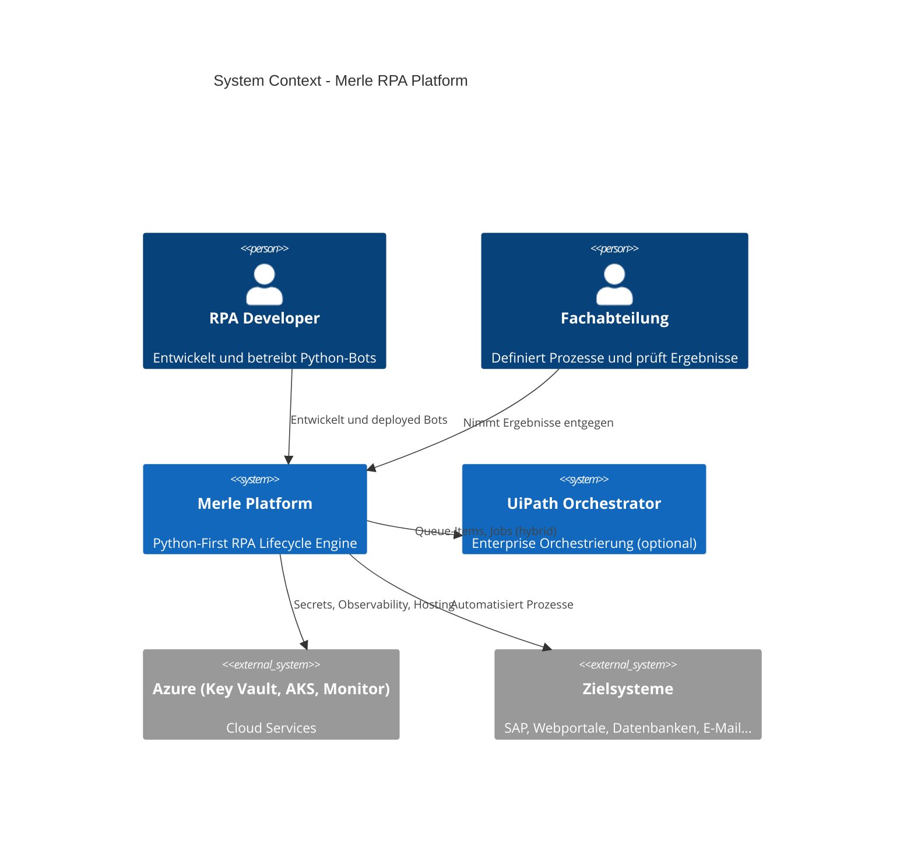
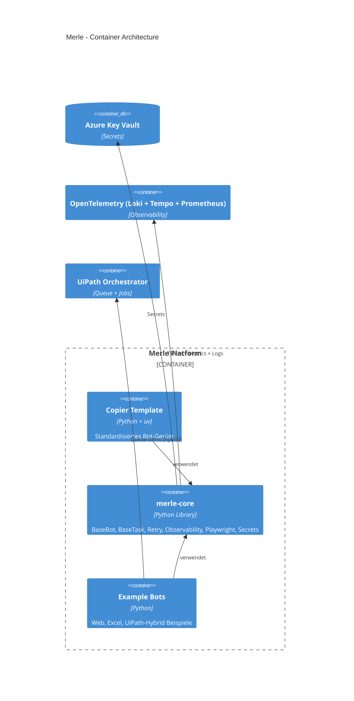

# Architektur von Merle

## C4 Context Diagram (Level 1)

## C4 Container Diagram (Level 2)

## Aktueller Stand: Prefect vs. NATS

| Aspekt                    | Prefect 3 (aktuell)          | NATS + JetStream (Vision)              | Status |
|---------------------------|------------------------------|----------------------------------------|--------|
| Orchestrierung            | Zentraler Server             | Dezentral, hochskalierbar              | Phase 4 geplant |
| State Management          | Prefect DB                   | NATS KV + Streams                      | - |
| UI / Transparenz          | Prefect UI                   | Cobra-NATS + BPMNinja                  | - |
| Self-Healing              | Begrenzt                     | Stark (Retry + Circuit Breaker)        | Schon in merle-core |
| Multi-Tenant / Isolation  | Gut                          | Exzellent (Streams + Consumers)        | - |
| Kosten / Betrieb          | Server notwendig             | Leichtgewichtig (kann in AKS laufen)   | - |

**Aktuelle Empfehlung (2026):**
- Für **komplexe Workflows** mit vielen Abhängigkeiten → Prefect 3
- Für **hochskalierbare, event-getriebene RPA** → NATS (Zielarchitektur)

---

## Technologie-Stack (2026)

- **Core**: Python 3.11+, uv, pydantic-settings
- **Resilienz**: tenacity, merle-core retry policies
- **Observability**: OpenTelemetry (OTLP) + loguru
- **Web**: Playwright (via merle-core wrapper)
- **Daten**: pandas, openpyxl, pdfplumber
- **Secrets**: Azure Key Vault
- **Container**: Docker (non-root, uv-basiert)
- **Orchestrierung**: Prefect 3 (heute) → NATS (Ziel)