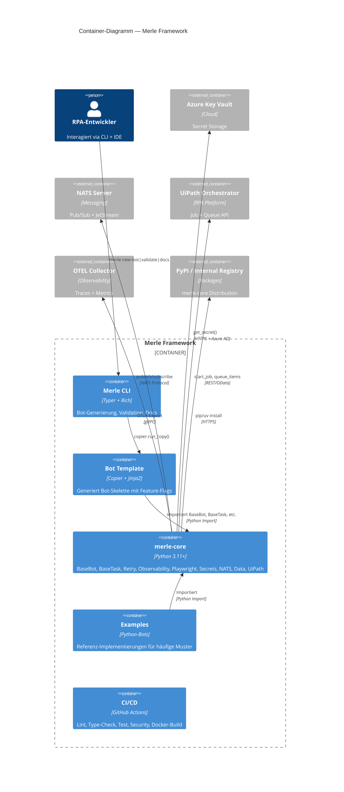

# Architektur-Komponenten

Merle besteht aus **7 logischen Hauptkomponenten**. Diese Einteilung folgt Verantwortlichkeiten, nicht dem Dateisystem.

## C4 Level 2 — Container-Diagramm

## Die 7 Komponenten

### 1. Merle CLI (`tools/merle/`)

**Verantwortlich für:** Entwicklungserlebnis. Bot-Generierung, Qualitäts-Validierung, Dokumentation.

| Aspekt              | Details                                                                        |
| ------------------- | ------------------------------------------------------------------------------ |
| **Owns**            | `merle new-bot`, `merle validate`, `merle docs`, `merle info`, `merle version` |
| **Technologie**     | Typer + Rich                                                                   |
| **Einziger Caller** | RPA-Entwickler (Mensch)                                                        |
| **Ruft**            | Copier (`templates/bot/`), mkdocs, Ruff, mypy, pytest                          |
| **Repo-Kopplung**   | Hartcodierte Pfad-Annahmen (4 Ebenen hoch zu Repo-Root)                        |
| **Mehr**            | [`../modules/merle-cli/index.md`](../modules/merle-cli/index.md)               |

### 2. Bot Template (`templates/bot/`)

**Verantwortlich für:** @tag:copier-template — Code-Generierung für neue Bots. Alleinige Quelle der Wahrheit für Bot-Struktur.

| Aspekt          | Details                                                                     |
| --------------- | --------------------------------------------------------------------------- |
| **Owns**        | Bot-Skelett (main.py, config.py, tasks/, tests/, Dockerfile, README)        |
| **Technologie** | Copier + Jinja2                                                             |
| **Caller**      | Merle CLI (via `copier.run_copy()`)                                         |
| **Generiert**   | `BaseBot`-Subklassen mit Feature-Flag-gesteuerten merle-core-Abhängigkeiten |
| **Mehr**        | [`../modules/bot-template/index.md`](../modules/bot-template/index.md)      |

### 3. merle-core (`packages/merle-core/`)

**Verantwortlich für:** @tag:basebot, @tag:basetask, @tag:retry, @tag:observability, @tag:playwright, @tag:secrets, @tag:nats, Datenverarbeitung, @tag:uipath-hybrid. Die zentrale, von allen Bots importierte Bibliothek.

| Aspekt          | Details                                                                                                                                             |
| --------------- | --------------------------------------------------------------------------------------------------------------------------------------------------- |
| **Owns**        | 10+ Submodule: BaseBot, BaseTask, Exceptions, Retry, HTTP-Client, Logging, Observability, Playwright, Secrets, NATS, Data (Excel/PDF/Email), UiPath |
| **Technologie** | Python 3.11+, optionale Extras via `try/except ImportError`                                                                                         |
| **Caller**      | Jeder generierte Bot, alle Examples, Integration Examples                                                                                           |
| **Ruft**        | loguru, tenacity, httpx, playwright, opentelemetry, nats-py, azure-identity, pdfplumber, pandas, openpyxl                                           |
| **Mehr**        | [`../modules/merle-core/index.md`](../modules/merle-core/index.md)                                                                                  |

### 4. Generierte Bots (`python_bots/`)

**Verantwortlich für:** Geschäftslogik. Jeder Bot ist eine `BaseBot`-Subklasse mit `BaseTask`-Zerlegung.

| Aspekt           | Details                                                                     |
| ---------------- | --------------------------------------------------------------------------- |
| **Owns**         | Domain-spezifische Automatisierung (Invoice Processing, Web Scraping, etc.) |
| **Entsteht aus** | Bot Template via `merle new-bot`                                            |
| **Importiert**   | merle-core (Pfad-Abhängigkeit im Monorepo, Package in standalone)           |
| **Ist**          | Immer Docker-fähig, getestet, mit README                                    |

### 5. Examples (`examples/`, `integration_examples/`)

**Verantwortlich für:** Referenz-Implementierungen. Zeigen Patterns, nicht Produktionscode.

| Aspekt            | Details                                                                                                                                                                                        |
| ----------------- | ---------------------------------------------------------------------------------------------------------------------------------------------------------------------------------------------- |
| **Owns**          | 5 Bot-Beispiele (invoice-processing, web-automation, excel-processing, uipath-hybrid, nats-task-communication) + 3 Integrationsmuster (orchestrator_api, python_scope, file_based_integration) |
| **Gold Standard** | `examples/invoice-processing/` — vollständige Pipeline mit allen merle-core-Features                                                                                                           |
| **Mehr**          | [`../modules/examples/index.md`](../modules/examples/index.md)                                                                                                                                 |

### 6. Integration Patterns (`integration_examples/`)

**Verantwortlich für:** Python↔UiPath @tag:uipath-hybrid Muster. Zeigt lose Kopplung via REST API, Dateien, Python Scope Activity.

| Aspekt     | Details                                                         |
| ---------- | --------------------------------------------------------------- |
| **Owns**   | Orchestrator API Client, File-Based Exchange, Python Scope Docs |
| **Caller** | Entwickler, die UiPath integrieren müssen                       |
| **Mehr**   | [`../modules/examples/index.md`](../modules/examples/index.md)  |

### 7. CI/CD (`.github/workflows/`)

**Verantwortlich für:** Qualitätsgates. Lint, Type-Check, Test, Security-Scans, Docker-Template-Validierung.

| Aspekt     | Details                                                                             |
| ---------- | ----------------------------------------------------------------------------------- | --- | ----------------------------------------------------- |
| **Owns**   | `ci.yml` (Quality + Security + Pre-commit + Docker), `docker-build.yml`, `docs.yml` |
| **Status** | Alle Gates derzeit non-fatal (`                                                     |     | true`, `continue-on-error`) während Refactoring-Phase |
| **Mehr**   | [`../modules/ci-cd/index.md`](../modules/ci-cd/index.md)                            |

## Anti-Patterns (Architektur)

- **Direktes `cp -r` ohne Template** → Immer @tag:copier-template verwenden
- **Hartcodierte Credentials** → Immer @tag:pydantic-settings + @tag:secrets
- **Bare `try/except` ohne Retry** → Immer @tag:retry via `@with_retry`
- **UiPath als Default** → Immer @tag:python-first, Entscheidungsmatrix anwenden
- **Ohne Dockerfile** → Immer @tag:docker, generiert vom Template
