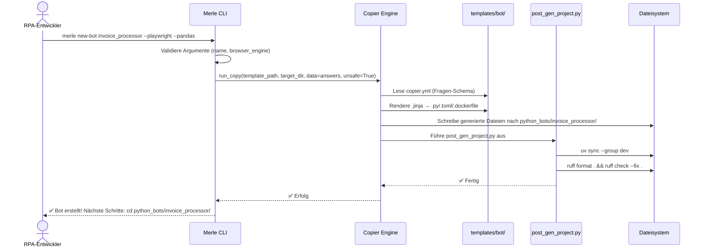
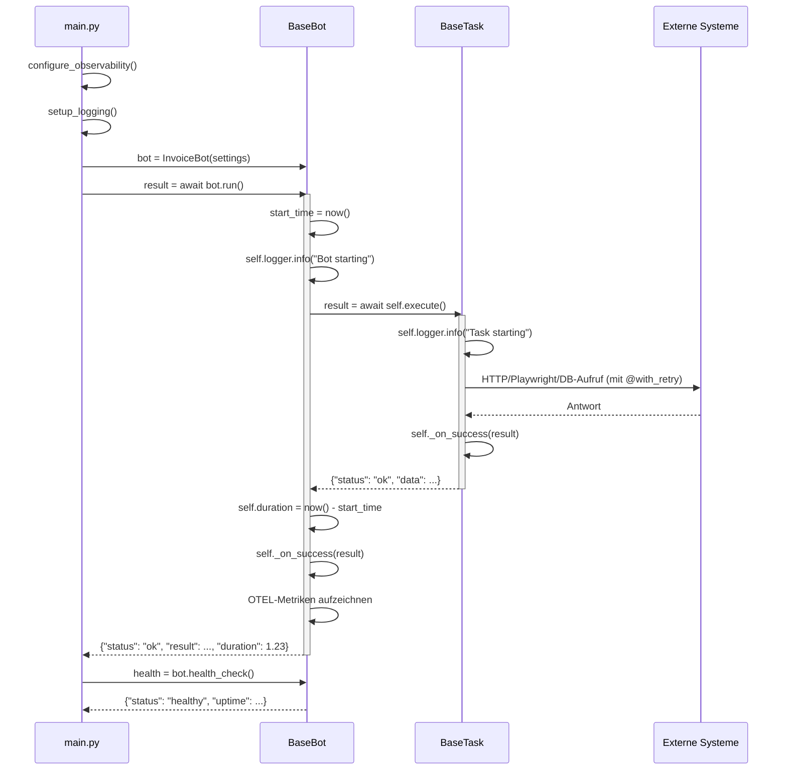
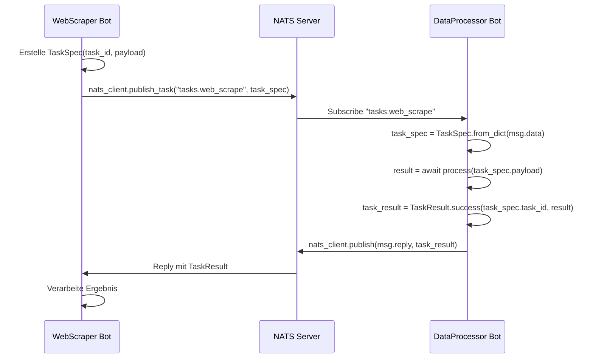
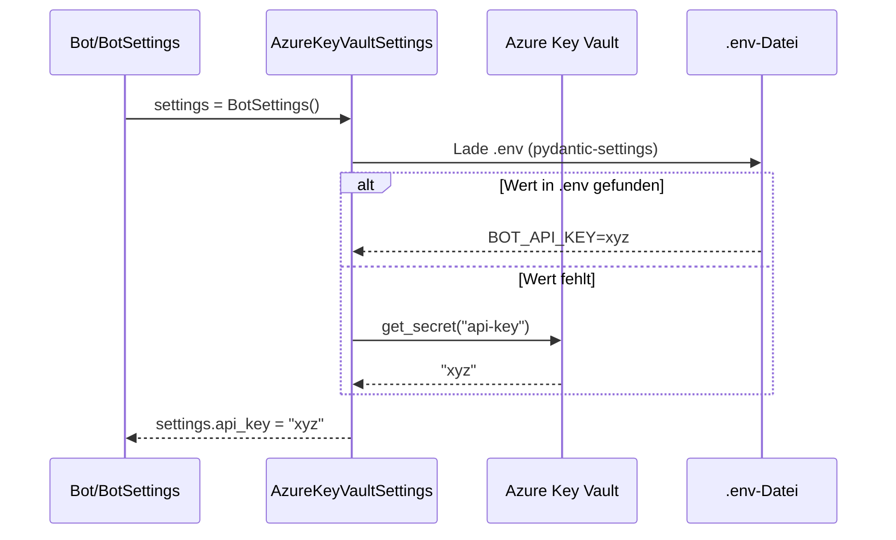

# Datenflüsse

## 1. Bot-Generierung (`merle new-bot`)

**Kritische Annahmen:** `unsafe=True` ist nötig, damit der Post-Generation-Hook läuft. Ohne diesen Flag wird `uv sync` nicht ausgeführt und der Bot ist nicht direkt lauffähig.

## 2. Bot-Ausführung (@tag:basebot Lifecycle)

**Invarianten:**

- `execute()` wird **nie direkt** aufgerufen — immer `run()`, das Timing + Logging + Hooks wrappt
- `_on_success` / `_on_failure` sind Hook-Methoden. Default-Implementierung logged nur.
- OTEL-Metriken werden nur aufgezeichnet, wenn `configure_observability()` vorher aufgerufen wurde

## 3. NATS Task-Kommunikation (@tag:nats, Phase 4 PoC)

**Aktueller Status:** PoC in `examples/nats-task-communication/`. Produktive JetStream-Nutzung (persistente Queues, Dead Letter Queue) in Phase 4 geplant (ADR-0006).

## 4. Secrets-Resolution (@tag:secrets)

**Fallback-Kette:** `.env` → Azure Key Vault → Fehler (kein Default-Fallback auf Hardcode).
