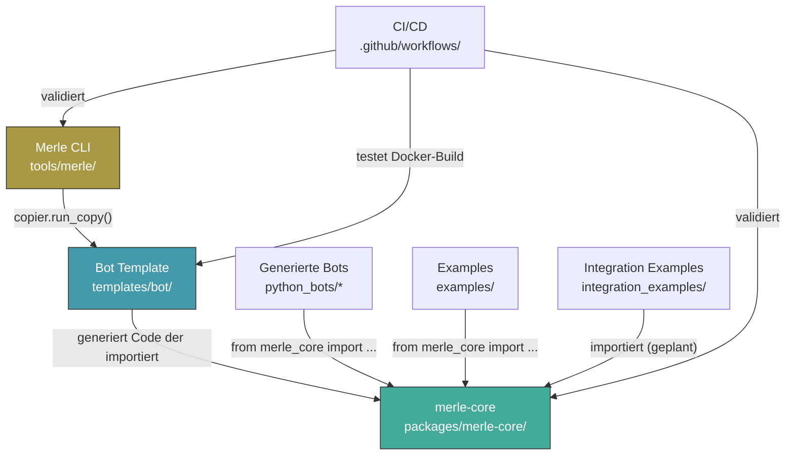

# Globale Abhängigkeiten

## Interner Abhängigkeitsgraph



## Externe Abhängigkeiten (merle-core)

| Externe Dependency                  | Version | Typ                              | Verwendet von                                                                                | Zweck                   |
| ----------------------------------- | ------- | -------------------------------- | -------------------------------------------------------------------------------------------- | ----------------------- |
| `loguru`                            | —       | hard                             | base_bot, base_task, retry, logging_config, observability, playwright, secrets, nats, uipath | Strukturiertes Logging  |
| `tenacity`                          | —       | hard                             | retry, http_client, nats                                                                     | Retry-Policies          |
| `httpx`                             | —       | hard                             | http_client, uipath/orchestrator, playwright/browser (für Lightpanda)                        | Async HTTP-Client       |
| `pydantic` / `pydantic-settings`    | —       | hard                             | secrets/pydantic                                                                             | Settings-Validation     |
| `playwright`                        | —       | optional (`playwright` extra)    | playwright/browser, playwright/utils                                                         | Browser-Automatisierung |
| `lightpanda`                        | —       | optional (`lightpanda` extra)    | playwright/browser                                                                           | Lightpanda CDP-Engine   |
| `opentelemetry-*`                   | —       | optional (`observability` extra) | observability/\*                                                                             | Tracing + Metrics       |
| `nats-py`                           | —       | optional (`nats` extra)          | nats/client                                                                                  | NATS Messaging          |
| `azure-identity` + `azure-keyvault` | —       | optional (`azure` extra)         | secrets/azure                                                                                | Azure Key Vault         |
| `pdfplumber`                        | —       | optional (`data` extra)          | data/pdf                                                                                     | PDF-Extraktion          |
| `pandas` + `openpyxl`               | —       | optional (`data` extra)          | data/excel                                                                                   | Excel-I/O               |

## Abhängigkeiten der CLI

| Externe Dependency | Version     | Typ                   | Zweck              |
| ------------------ | ----------- | --------------------- | ------------------ |
| `typer`            | ≥0.12,<0.16 | hard                  | CLI-Framework      |
| `rich`             | ≥13.0,<14.0 | hard                  | Terminal-Output    |
| `copier`           | ≥9.3,<10.0  | optional (try/except) | Template-Rendering |

## Abhängigkeitsrichtung

**Kernregel:** `merle-core` ist das Fundament. Alles andere hängt von `merle-core` ab, nicht umgekehrt.

```
merle-core          ← Keine internen Abhängigkeiten (nur externe)
    ↑
    ├── Bot Template    ← Generiert Code, der merle-core importiert
    ├── Generierte Bots ← Importieren merle-core
    ├── Examples        ← Importieren merle-core
    └── Integration Ex. ← Importieren merle-core (geplant)

Merle CLI           ← Hängt von Copier ab, nicht von merle-core
    ↑
    └── (nichts)        ← Nur vom Entwickler aufgerufen
```

## @tag:optional-imports

Viele merle-core-Module sind optional. Das Paket funktioniert auch ohne `playwright`, `opentelemetry`, `nats-py` etc. Fehlende Imports werden via `try/except ImportError` abgefangen:

```python
# In merle_core/__init__.py:
try:
    from merle_core.playwright import RobustBrowser
except ImportError:
    pass  # Playwright nicht installiert — OK
```

Dieses Pattern ist **absichtlich** und soll nicht durch harte Dependencies ersetzt werden. Es ermöglicht minimale Bot-Installationen ohne unnötige Abhängigkeiten.
