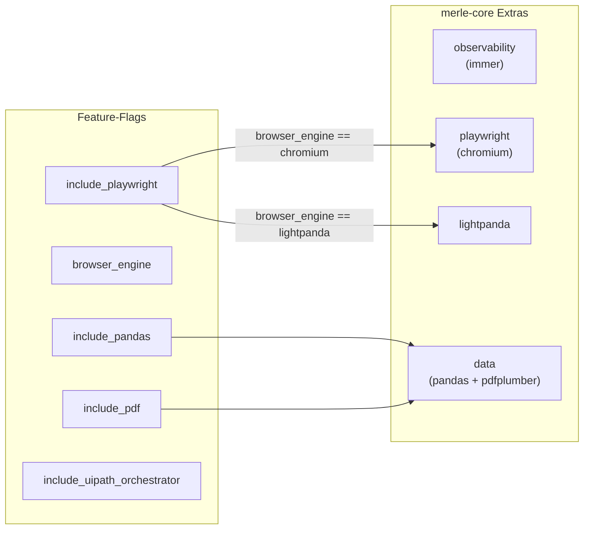
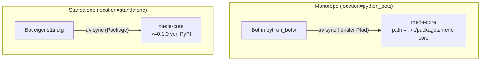

# Bot Template — Abhängigkeiten

## Outbound (Wovon hängt das Template ab?)

| Abhängigkeit   | Typ                          | Zweck                                                                                                                           |
| -------------- | ---------------------------- | ------------------------------------------------------------------------------------------------------------------------------- |
| **merle-core** | Import (im generierten Code) | @tag:basebot, @tag:basetask, @tag:retry, @tag:observability, @tag:playwright, @tag:secrets, @tag:nats, Data, @tag:uipath-hybrid |
| **Copier**     | Build-Tool (via CLI)         | Template-Rendering-Engine                                                                                                       |
| **uv**         | Runtime (via Hook)           | Dependency-Installation im generierten Bot                                                                                      |
| **ruff**       | Runtime (via Hook)           | Format + Lint des generierten Codes                                                                                             |
| **Jinja2**     | Engine (via Copier)          | Template-Sprache (Conditionals, Loops, Variablen)                                                                               |

## Inbound (Wer hängt vom Template ab?)

| Abhängiger    | Typ         | Zweck                                                    |
| ------------- | ----------- | -------------------------------------------------------- |
| **Merle CLI** | Aufrufer    | `merle new-bot` → `copier.run_copy(templates/bot/, ...)` |
| **CI/CD**     | Validierung | `docker-build.yml` generiert Test-Bot aus Template       |

## Feature-Flag → merle-core-Extra Mapping



## Standalone vs. Monorepo Dependency-Resolution



**Kritisch:** In Monorepo funktioniert der relative Pfad nur, weil uv-Workspace-Member-Konfiguration im Root-`pyproject.toml` existiert:

```toml
# Root pyproject.toml
[tool.uv.workspace]
members = ["packages/merle-core", "tools/merle"]
```

## Docker-Build-Abhängigkeiten

Der Docker-Build benötigt **Build-Kontext = Repo-Root** (nicht das Bot-Verzeichnis):

```bash
# ✅ Richtig — vom Repo-Root:
docker build -f python_bots/my_bot/Dockerfile \
  --build-arg BUILD_MODE=monorepo \
  --build-arg BOT_PATH=python_bots/my_bot \
  -t my_bot:latest .

# ✅ Convenience:
just docker-bot my_bot

# ❌ Falsch — vom Bot-Verzeichnis:
cd python_bots/my_bot && docker build .
# → COPY packages/merle-core schlägt fehl (falscher Kontext)
```

Das Dockerfile kopiert `packages/merle-core` und `${BOT_PATH}` und spiegelt die Monorepo-Layout-Struktur, damit die Path-Dependency `../../packages/merle-core` im Builder auflöst. `BUILD_MODE=standalone` baut stattdessen ein lokales merle-core-Wheel (kein privates PyPI).
