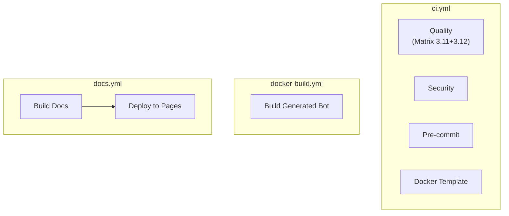

# CI/CD — Abhängigkeiten

## Workflow-Trigger

| Workflow           | Trigger-Events                             | Pfad-Filter                                                               |
| ------------------ | ------------------------------------------ | ------------------------------------------------------------------------- |
| `ci.yml`           | `push`, `pull_request` → `main`, `develop` | Keine (läuft immer)                                                       |
| `docker-build.yml` | `push`, `pull_request`                     | `templates/bot/**`, `.dockerignore`, `.github/workflows/docker-build.yml` |
| `docs.yml`         | `push` → `main`                            | `docs/**`, `mkdocs.yml`, `AGENTS.md`, `README*.md`                        |

## Job-Abhängigkeiten

Keine Cross-Workflow-Abhängigkeiten. Jeder Workflow ist unabhängig.

## Externe Actions

| Action                             | Verwendet in     | Zweck                    |
| ---------------------------------- | ---------------- | ------------------------ |
| `actions/checkout@v4`              | Alle             | Code auschecken          |
| `actions/setup-python@v5`          | ci.yml           | Python installieren      |
| `astral-sh/setup-uv@v5`            | ci.yml, docs.yml | uv installieren          |
| `docker/setup-buildx-action@v3`    | docker-build.yml | Docker Buildx            |
| `docker/build-push-action@v6`      | docker-build.yml | Docker Build             |
| `actions/cache@v4`                 | ci.yml           | uv-Cache                 |
| `actions/upload-artifact@v4`       | docs.yml         | Build-Artefakt hochladen |
| `actions/deploy-pages@v4`          | docs.yml         | GitHub Pages deployen    |
| `aquasecurity/trivy-action@master` | ci.yml           | Trivy Security Scan      |
| `trufflesecurity/trufflehog@main`  | ci.yml           | Secrets Detection        |
| `pre-commit/action@v3`             | ci.yml           | Pre-commit ausführen     |

## Tools (via `uv run`)

| Tool             | Verwendet in             | Zweck          |
| ---------------- | ------------------------ | -------------- |
| `ruff`           | ci.yml (Quality)         | Lint + Format  |
| `mypy`           | ci.yml (Quality)         | Type-Check     |
| `pytest`         | ci.yml (Quality)         | Tests          |
| `merle validate` | ci.yml (Quality)         | CLI-Validate   |
| `copier`         | ci.yml, docker-build.yml | Bot generieren |
| `mkdocs`         | docs.yml                 | Docs bauen     |
| `bandit`         | ci.yml (Security)        | SAST           |
