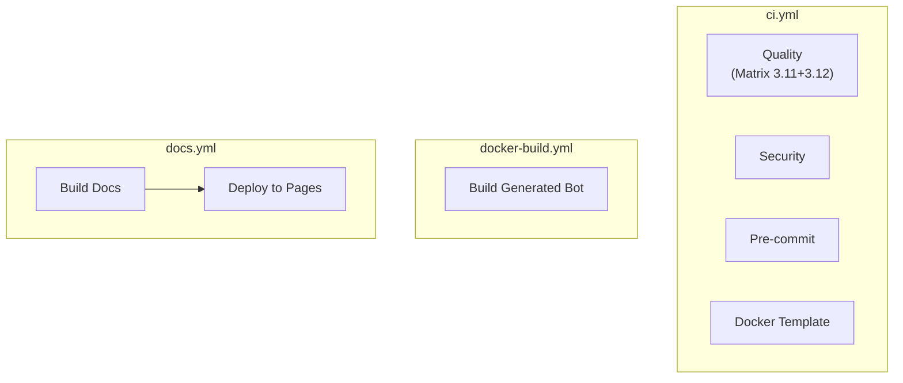

# CI/CD — Abhängigkeiten

## Workflow-Trigger

| Workflow           | Trigger-Events                             | Pfad-Filter                                                               |
| ------------------ | ------------------------------------------ | ------------------------------------------------------------------------- |
| `ci.yml`           | `push`, `pull_request` → `main`, `develop` | Keine (läuft immer)                                                       |
| `docker-build.yml` | `push`, `pull_request`                     | `templates/bot/**`, `.dockerignore`, `.github/workflows/docker-build.yml` |
| `docs.yml`         | `push` → `main`                            | `docs/**`, `mkdocs.yml`, `AGENTS.md`, `README*.md`                        |

## Job-Abhängigkeiten

Keine Cross-Workflow-Abhängigkeiten. Jeder Workflow ist unabhängig.

## Externe Actions

| Action                               | Verwendet in                       | Zweck                                        |
| ------------------------------------ | ---------------------------------- | -------------------------------------------- |
| `actions/checkout@v7`                | Alle                               | Code auschecken (Security: `fetch-depth: 0`) |
| `astral-sh/setup-uv@v7`              | ci.yml, docs.yml, docker-build.yml | uv installieren                              |
| `docker/setup-buildx-action@v4`      | docker-build.yml                   | Docker Buildx                                |
| `docker/build-push-action@v7`        | docker-build.yml                   | Docker Build                                 |
| `actions/cache@v6`                   | ci.yml                             | pre-commit-Cache                             |
| `actions/upload-pages-artifact@v5`   | docs.yml                           | Pages-Artefakt hochladen                     |
| `actions/deploy-pages@v5`            | docs.yml                           | GitHub Pages deployen                        |
| `aquasecurity/trivy-action@v0.36.0`  | ci.yml                             | Trivy Security Scan                          |
| `trufflesecurity/trufflehog@v3.95.9` | ci.yml                             | Secrets Detection (event-aware)              |

## Tools (via `uv run`)

| Tool             | Verwendet in             | Zweck          |
| ---------------- | ------------------------ | -------------- |
| `ruff`           | ci.yml (Quality)         | Lint + Format  |
| `mypy`           | ci.yml (Quality)         | Type-Check     |
| `pytest`         | ci.yml (Quality)         | Tests          |
| `merle validate` | ci.yml (Quality)         | CLI-Validate   |
| `copier`         | ci.yml, docker-build.yml | Bot generieren |
| `mkdocs`         | docs.yml                 | Docs bauen     |
| `bandit`         | ci.yml (Security)        | SAST           |
