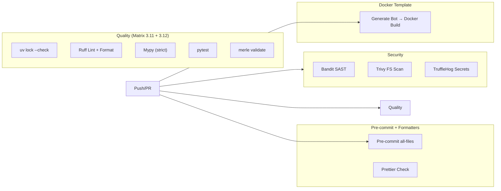

# CI/CD — Workflows & Quality Gates

**Pfad:** `.github/workflows/` | **Plattform:** GitHub Actions

Drei Workflows setzen die Qualitätsgates für das Merle-Repository durch.

## Workflow-Übersicht

| Workflow             | Trigger                                              | Jobs                                                              | Status                                            |
| -------------------- | ---------------------------------------------------- | ----------------------------------------------------------------- | ------------------------------------------------- |
| **ci.yml**           | Push/PR → `main`, `develop`                          | Quality (Matrix 3.11+3.12), Security, Pre-commit, Docker-Template | Quality / Security / Pre-commit / Docker **HARD** |
| **docker-build.yml** | Push/PR → `templates/bot/**`, `workflow_dispatch`    | Build + Verify generierter Bot                                    | Aktiv                                             |
| **docs.yml**         | Push → `main` (docs-Änderungen), `workflow_dispatch` | Build + Deploy → GitHub Pages                                     | Deploy `continue-on-error`                        |

## CI Pipeline (`ci.yml`)

## Quality Gates — Status

| Gate               | Tool                    | Fatal?       | Anmerkung                                                   |
| ------------------ | ----------------------- | ------------ | ----------------------------------------------------------- |
| Lockfile Integrity | `uv lock --check`       | ✅ Ja (HARD) | Quality-Job                                                 |
| Lint               | ruff check              | ✅ Ja (HARD) | Kein `\|\| true`                                            |
| Format             | ruff format --check     | ✅ Ja (HARD) | Kein `\|\| true`                                            |
| Type Check         | mypy --strict           | ✅ Ja (HARD) | Scope: `packages/merle-core`                                |
| Tests              | pytest + coverage       | ✅ Ja (HARD) | Scope: `packages/merle-core`; `--cov-fail-under=70`         |
| CLI Validate       | merle validate --strict | ✅ Ja (HARD) | Governance; Exit 1 bei Ruff/Mypy/Pytest-Fehlern             |
| SAST               | Bandit (`-ll`)          | ✅ Ja (HARD) | Medium+ auf `merle-core` + `tools/merle`                    |
| FS Vuln            | Trivy (CRITICAL+HIGH)   | ✅ Ja (HARD) | `exit-code: "1"`, `ignore-unfixed: true`                    |
| Secrets            | TruffleHog              | ✅ Ja (HARD) | Event-aware (kein fixed `base: main`); action pins `--fail` |
| Pre-commit         | pre-commit run          | ✅ Ja (HARD) | Full suite + Prettier auf geänderte Non-Python-Files        |
| Docker Build       | docker build            | ✅ Ja (HARD) | Template-Validierung (Copier → monorepo Docker build)       |

**Branch Protection (intended Required Checks):** Quality (py3.11 + py3.12), Security Scan, pre-commit + Formatters, Docker Template Validation.

## Bot-Generierung

- **[`responsibility.md`](./responsibility.md)** — Was jeder Workflow prüft, was hard vs. soft ist
- **[`dependencies.md`](./dependencies.md)** — Workflow-Trigger, Job-Abhängigkeiten, externe Actions
