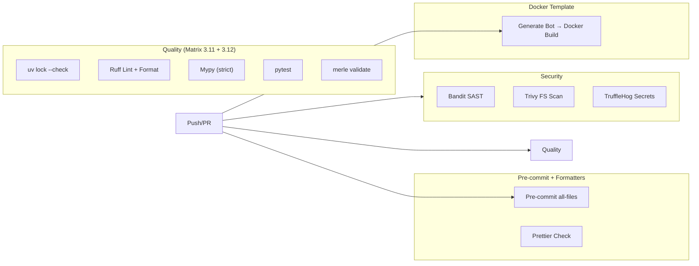

# CI/CD — Workflows & Quality Gates

**Pfad:** `.github/workflows/` | **Plattform:** GitHub Actions

Drei Workflows setzen die Qualitätsgates für das Merle-Repository durch.

## Workflow-Übersicht

| Workflow             | Trigger                                              | Jobs                                                              | Status                     |
| -------------------- | ---------------------------------------------------- | ----------------------------------------------------------------- | -------------------------- |
| **ci.yml**           | Push/PR → `main`, `develop`                          | Quality (Matrix 3.11+3.12), Security, Pre-commit, Docker-Template | Gates derzeit non-fatal    |
| **docker-build.yml** | Push/PR → `templates/bot/**`, `workflow_dispatch`    | Build + Verify generierter Bot                                    | Aktiv                      |
| **docs.yml**         | Push → `main` (docs-Änderungen), `workflow_dispatch` | Build + Deploy → GitHub Pages                                     | Deploy `continue-on-error` |

## CI Pipeline (`ci.yml`)

## Quality Gates — Status

| Gate               | Tool                  | Fatal?                 | Anmerkung                              |
| ------------------ | --------------------- | ---------------------- | -------------------------------------- |
| Lockfile Integrity | `uv lock --check`     | ✅ Ja                  | Einziges hartes Gate                   |
| Lint               | ruff check            | ❌ `\|\| true`         | Temporär non-fatal (Refactoring-Phase) |
| Format             | ruff format --check   | ❌ `\|\| true`         | Temporär non-fatal                     |
| Type Check         | mypy --strict         | ❌ `\|\| true`         | Temporär non-fatal                     |
| Tests              | pytest                | ❌ `\|\| true`         | Temporär non-fatal                     |
| CLI Validate       | merle validate        | ❌ `\|\| true`         | Temporär non-fatal                     |
| SAST               | Bandit                | ❌ `continue-on-error` | Wird geloggt                           |
| FS Vuln            | Trivy (CRITICAL+HIGH) | ❌ `continue-on-error` | Nur CRITICAL+HIGH                      |
| Secrets            | TruffleHog            | ❌ `continue-on-error` | Wird geloggt                           |
| Pre-commit         | pre-commit run        | ❌ `\|\| true`         | Temporär non-fatal                     |
| Docker Build       | docker build          | ❌ `\|\| true`         | Template-Validierung                   |

**Wichtig:** Alle Non-Fatal-Gates sind **temporär** während der Refactoring-Phase (Phase 3/4). Nach Stabilisierung werden sie auf Fatal umgestellt.

## Bot-Generierung

- **[`responsibility.md`](./responsibility.md)** — Was jeder Workflow prüft, was non-fatal ist
- **[`dependencies.md`](./dependencies.md)** — Workflow-Trigger, Job-Abhängigkeiten, externe Actions
