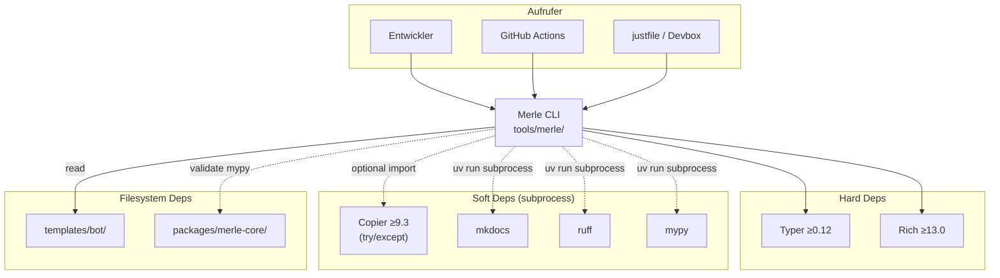

# Merle CLI — Abhängigkeiten

## Outbound (Wovon hängt die CLI ab?)

| Abhängigkeit               | Typ                   | Zweck                                      | Kritisch?                                        |
| -------------------------- | --------------------- | ------------------------------------------ | ------------------------------------------------ |
| **Copier** (`>=9.3`)       | optional (try/except) | Template-Rendering via `run_copy()`        | Ja — ohne Copier kein `new-bot`                  |
| **Typer** (`>=0.12`)       | hard                  | CLI-Framework (Commands, Args, Help)       | Ja — das gesamte CLI-Framework                   |
| **Rich** (`>=13.0`)        | hard                  | Terminal-Output (Tabellen, Panels, Farben) | Nein — CLI würde ohne Rich laufen, aber hässlich |
| **mkdocs** (via `uv run`)  | soft (subprocess)     | `merle docs` → `uv run mkdocs`             | Nur für `docs`-Befehl                            |
| **ruff** (via `uv run`)    | soft (subprocess)     | `merle validate` → `uv run ruff`           | Nur für `validate`-Befehl                        |
| **mypy** (via `uv run`)    | soft (subprocess)     | `merle validate` → `uv run mypy`           | Nur für `validate`-Befehl                        |
| **`templates/bot/`**       | filesystem            | Quelle für @tag:copier-template            | Ja — ohne Template kein `new-bot`                |
| **`packages/merle-core/`** | filesystem (indirekt) | `merle validate` prüft merle-core via mypy | Nur für `validate --core-only`                   |

## Inbound (Wer ruft die CLI auf?)

| Aufrufer             | Typ     | Zweck                                                         |
| -------------------- | ------- | ------------------------------------------------------------- |
| **RPA-Entwickler**   | direkt  | `merle new-bot`, `merle validate`, `merle docs`, `merle info` |
| **CI/CD** (`ci.yml`) | direkt  | `merle validate` als Teil der Quality-Gates                   |
| **Devbox / just**    | wrapper | `devbox run new-bot`, `just new-bot` → `merle new-bot`        |

## Abhängigkeitsgraph



## Kritische Kopplungen

### 1. Repo-Struktur-Abhängigkeit

Die CLI nimmt an, dass sie in `tools/merle/merle/main.py` liegt und das Repo-Root **exakt 4 Ebenen höher** ist:

```python
def _get_repo_root():
    return Path(__file__).resolve().parent.parent.parent.parent
    # tools/merle/merle/main.py
    #      ↑3    ↑2    ↑1    ↑0
    #         parent.parent.parent.parent = repo root
```

**Folge:** Die CLI funktioniert **nur innerhalb des Merle-Monorepos**. Verschieben von `tools/merle/` an einen anderen Ort bricht `_get_repo_root()` und damit alle Befehle.

### 2. Copier-Import-Fallback

```python
try:
    from copier import run_copy
except ImportError:
    run_copy = None
```

Wenn Copier nicht installiert ist (weil `uv sync --group dev` nicht ausgeführt wurde), zeigt `merle new-bot` eine Fehlermeldung mit Installationsanweisung — aber die CLI selbst startet trotzdem.

### 3. Template-Pfad-Hardcode

Die CLI nimmt an, dass das Template unter `<repo_root>/templates/bot/` liegt. Es gibt keine Konfigurationsmöglichkeit, einen anderen Template-Pfad anzugeben.

### 4. Keine merle-core-Abhängigkeit

Die CLI **importiert merle-core nicht**. Das ist Absicht — die CLI ist ein reines Tool, das nur Copier aufruft und Subprocess-Checks ausführt. Sie muss nicht im gleichen Python-Environment wie merle-core laufen.
