# merle-core — Abhängigkeiten

## Inbound (Wer hängt von mir ab?)

| Abhängiger               | Typ              | Zweck                                                            | Pfad/Import                    |
| ------------------------ | ---------------- | ---------------------------------------------------------------- | ------------------------------ |
| **Bot Template**         | code-gen         | Generiert Bots, die `from merle_core import BaseBot, ...` nutzen | `templates/bot/**/*.jinja`     |
| **Generierte Bots**      | import           | Alle Bots unter `python_bots/` importieren merle-core            | `from merle_core import ...`   |
| **Examples**             | import           | Alle Referenz-Bots importieren merle-core                        | `examples/**/main.py`          |
| **Integration Examples** | import (geplant) | Orchestrator-API-Client wird auf `merle_core.uipath` migriert    | `integration_examples/**/*.py` |
| **CI/CD**                | validation       | `mypy --strict`, `pytest packages/merle-core/`                   | `.github/workflows/ci.yml`     |

## Outbound (Wovon hänge ich ab?)

### Harte Dependencies (ohne diese funktioniert das Basispaket nicht)

| Dependency                       | Version   | Typ  | Genutzt in                                                                                           | Zweck                                           |
| -------------------------------- | --------- | ---- | ---------------------------------------------------------------------------------------------------- | ----------------------------------------------- |
| `loguru`                         | (unfixed) | hard | base_bot, base_task, retry, logging_config, observability/logging, playwright, secrets, nats, uipath | Strukturiertes Logging                          |
| `tenacity`                       | (unfixed) | hard | retry, http_client, nats                                                                             | Retry-Policies (exponentielles Backoff, Jitter) |
| `httpx`                          | (unfixed) | hard | http_client, uipath/orchestrator, playwright/browser (Lightpanda CDP Health-Check)                   | Async HTTP-Client                               |
| `pydantic` + `pydantic-settings` | (unfixed) | hard | secrets/pydantic                                                                                     | Settings-Validation + Key-Vault-Integration     |

### Optionale Extras (Paket funktioniert ohne sie)

| Extra-Name      | Dependencies                                                                       | Genutzt in                           | Zweck                            |
| --------------- | ---------------------------------------------------------------------------------- | ------------------------------------ | -------------------------------- |
| `playwright`    | `playwright`                                                                       | playwright/browser, playwright/utils | Chromium-Browser-Automatisierung |
| `lightpanda`    | `lightpanda`                                                                       | playwright/browser                   | Lightpanda CDP-Engine            |
| `observability` | `opentelemetry-api`, `opentelemetry-sdk`, `opentelemetry-exporter-otlp-proto-grpc` | observability/\*                     | Tracing + Metrics (OTLP/gRPC)    |
| `nats`          | `nats-py`                                                                          | nats/client                          | NATS Pub/Sub + JetStream         |
| `azure`         | `azure-identity`, `azure-keyvault-secrets`                                         | secrets/azure                        | Azure Key Vault Secrets          |
| `data`          | `pandas`, `openpyxl`, `pdfplumber`                                                 | data/excel, data/pdf                 | Excel + PDF-Verarbeitung         |

### Modul-interne Abhängigkeiten

```mermaid
graph TD
    init["__init__.py<br/>(Public API)"]

    subgraph "Core (keine internen Deps)"
        bot["base_bot.py"]
        task_cls["base_task.py"]
        exceptions["exceptions.py"]
        http["http_client.py"]
        logging["logging_config.py"]
        task_model["task.py"]
    end

    subgraph "Hängt von exceptions ab"
        retry["retry.py"]
        pw["playwright/"]
        secrets["secrets/"]
        data["data/"]
        uipath["uipath/"]
    end

    subgraph "Hängt von retry + task_model ab"
        nats["nats/"]
    end

    subgraph "Hängt von base ab"
        azure_impl["secrets/azure.py"]
    end

    subgraph "Hängt von azure ab"
        pydantic_secrets["secrets/pydantic.py"]
    end

    subgraph "Optional: Hängt von metrics ab"
        bot_metrics["base_bot.py<br/>(OTEL-Zweig)"]
        task_metrics["base_task.py<br/>(OTEL-Zweig)"]
    end

    init --> bot
    init --> task_cls
    init --> task_model
    init --> exceptions
    init --> retry
    init --> http
    init --> logging
    init --> pw
    init --> secrets
    init --> nats
    init --> data
    init --> uipath

    retry --> exceptions
    pw --> exceptions
    secrets --> exceptions
    data --> exceptions
    uipath --> exceptions

    nats --> retry
    nats --> task_model

    azure_impl --> secrets
    pydantic_secrets --> azure_impl

    bot -.->|"try/except ImportError"| bot_metrics
    task_cls -.->|"try/except ImportError"| task_metrics

    style init fill:#4a9,stroke:#333,color:#fff
    style exceptions fill:#a44,stroke:#333,color:#fff
```



**Beachte:** `base_bot.py` und `base_task.py` haben **optionale** OTEL-Metrik-Integration. Ohne `observability`-Extra werden keine Metriken aufgezeichnet — aber der Bot läuft normal.

## @tag:optional-imports Mechanismus

Jedes optionale Modul wird so eingebunden:

```python
# In __init__.py:
try:
    from merle_core.playwright import launch_robust_browser, RobustBrowser
except ImportError:
    pass  # Playwright nicht installiert — kein Problem

# In base_bot.py:
try:
    from merle_core.observability.metrics import create_bot_metrics
    _METRICS_AVAILABLE = True
except ImportError:
    _METRICS_AVAILABLE = False
```

Dieses Pattern ist **bewusst gewählt** und sollte nicht durch harte Dependencies ersetzt werden. Es ermöglicht:

- Minimale Installationen für einfache Bots (kein Playwright/OTEL nötig)
- Keine ImportError-Abbrüche bei fehlenden Extras
- Klare Trennung: Bot-Entwickler entscheiden, welche Extras sie brauchen
