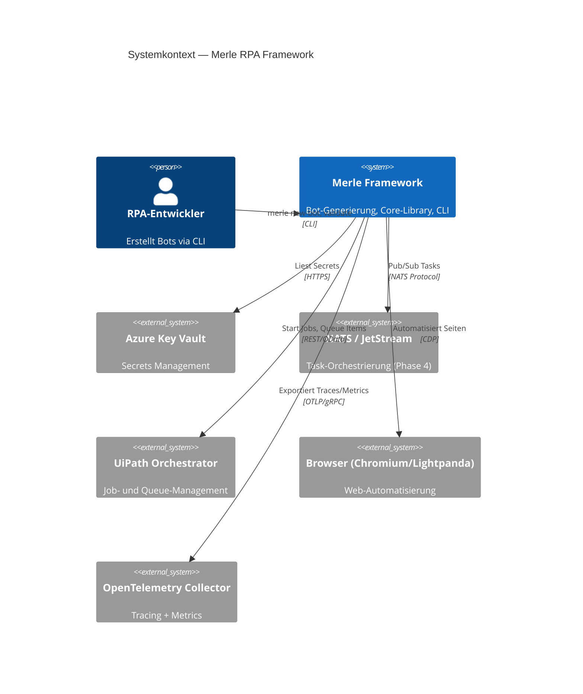

# Merle — Übersicht

**Merle — Modular Enterprise RPA Lifecycle Engine.** Ein Python-first Framework für wartbare, testbare, Linux-fähige RPA-Roboter mit optionaler UiPath-Integration.

## Projektzweck

Merle standardisiert die Entwicklung von RPA-Robotern in heterogenen Enterprise-Umgebungen. Es ersetzt ad-hoc-Scripting und proprietäre UiPath-Monolithen durch ein Framework aus:

- **Generierten Bot-Skeletten** (@tag:copier-template) mit eingebauter Resilience, Observability und Testbarkeit
- **Einer zentralen Core-Bibliothek** (@tag:basebot, @tag:basetask) mit geteilten Patterns
- **Entscheidungsmatrix-basierter Technologiewahl** (@tag:python-first): 80-90% Python, UiPath nur bei nachgewiesenem Vorteil
- **Locker gekoppelter UiPath-Integration** (@tag:uipath-hybrid) via NATS/Orchestrator-API

## Architektur-Zusammenfassung

**Container (C4 Level 2):** Siehe [`architecture/components.md`](./architecture/components.md).

## Tech-Stack

| Kategorie                | Technologie                          | Version                                        |
| ------------------------ | ------------------------------------ | ---------------------------------------------- |
| **Sprache**              | Python                               | 3.11+                                          |
| **Paketmanager**         | uv (Workspace-Monorepo)              | 0.11.8+                                        |
| **Entwicklungsumgebung** | Devbox + direnv                      | —                                              |
| **Bot-Scaffolding**      | Copier                               | 9.15+                                          |
| **CLI**                  | Typer + Rich                         | 0.12+ / 13.0+                                  |
| **Browser**              | Playwright (Chromium + Lightpanda)   | merle-core extras (`playwright`, `lightpanda`) |
| **Config**               | pydantic-settings                    | via merle-core                                 |
| **Logging**              | loguru                               | via merle-core                                 |
| **Retry**                | tenacity                             | via merle-core                                 |
| **HTTP**                 | httpx (async)                        | via merle-core                                 |
| **Observability**        | OpenTelemetry (OTLP/gRPC)            | optional (extra `observability`)               |
| **Secrets**              | Azure Key Vault                      | optional (extra `azure`)                       |
| **Messaging**            | NATS (nats-py)                       | optional (extra `nats`)                        |
| **Orchestrierung**       | Prefect 3 → NATS JetStream (Phase 4) | —                                              |
| **Qualität**             | Ruff, mypy (strict), pytest          | via dev                                        |
| **CI/CD**                | GitHub Actions                       | —                                              |
| **Dokumentation**        | MkDocs Material                      | —                                              |

## Governance (11 Regeln, verbindlich)

Die vollständigen Regeln stehen in `docs/concepts/governance.md`. Hier die Kurzfassung:

1. **@tag:python-first** — Python ist Default
2. **@tag:copier-template** — Template ist Pflicht
3. **@tag:pydantic-settings** — Keine hartcodierten Werte
4. **@tag:loguru** — Strukturiertes Logging
5. **@tag:retry** — Retry für alle externen Aufrufe
6. **Tests ≥ 70%** Abdeckung
7. **@tag:docker** — Linux-Container-Kompatibilität
8. **README.md** für jeden Bot
9. **Code Review** für jede Änderung
10. **@tag:basebot** — merle-core ist Pflicht (BaseBot/BaseTask)
11. **ADR** für jede Technologieentscheidung

## Wichtige Pfade

| Pfad                    | Zweck                                                             |
| ----------------------- | ----------------------------------------------------------------- |
| `packages/merle-core/`  | @tag:basebot, @tag:basetask, @tag:retry, @tag:observability, etc. |
| `tools/merle/`          | CLI (`merle new-bot`, `merle validate`, etc.)                     |
| `templates/bot/`        | Copier-Template für @tag:copier-template                          |
| `python_bots/`          | Generierte Bots (monorepo-Modus)                                  |
| `examples/`             | Referenz-Bots (invoice-processing, web-automation, etc.)          |
| `integration_examples/` | Python↔UiPath @tag:uipath-hybrid Muster                          |
| `docs/concepts/`        | Strategie, Entscheidungsmatrix, Governance                        |
| `docs/decisions/`       | ADRs (0001–0009)                                                  |
| `agent/CLAUDE.md`       | RPA-Hybrid-Architekt Persona                                      |
| `AGENTS.md`             | Einstiegspunkt für Coding Agents                                  |
