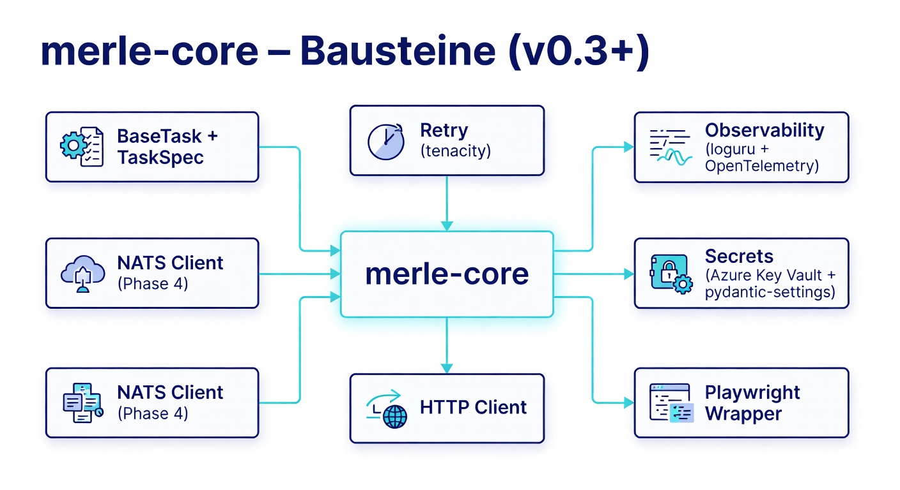

# merle-core

`merle-core` ist das **zentrale, wiederverwendbare Python-Package** für alle Merle-Bots.

Es kapselt wiederkehrende Infrastruktur (Resilienz, Observability, Secrets, Browser-Steuerung, NATS-Kommunikation), sodass Entwickler sich fast ausschließlich auf die fachliche Business-Logik konzentrieren können.

## Verfügbare Bausteine



## Schnellstart

```bash
uv add merle-core                           # Basis (BaseTask, Retry, Logging, Secrets)
uv add merle-core[playwright]               # + Playwright Wrapper
uv add merle-core[observability]            # + OpenTelemetry + Logging
uv add merle-core[nats]                     # + NATS Client (Phase 4)
```

## Kern-Module

| Modul | Beschreibung | Dokumentation |
|-------|--------------|---------------|
| **BaseBot & BaseTask** | Grundgerüst für alle Bots und Tasks | [Base Classes](base-classes.md) |
| **Retry & Resilienz** | `@with_retry` + vordefinierte Policies | [Retry](retry.md) |
| **Observability** | Loguru + OpenTelemetry (Traces, Metrics, Logs) | [Observability](observability.md) |
| **Playwright Wrapper** | Headless-fähige Browser-Automatisierung | [Playwright](playwright.md) |
| **Secrets** | Azure Key Vault + pydantic-settings | [Secrets](secrets.md) |
| **NATS Client** | Publish/Subscribe + Request/Reply (Phase 4) | [NATS](nats.md) |

---

**Aktuelle Version**: Wird aus `python_bots/shared/` als installierbares Package gebaut.